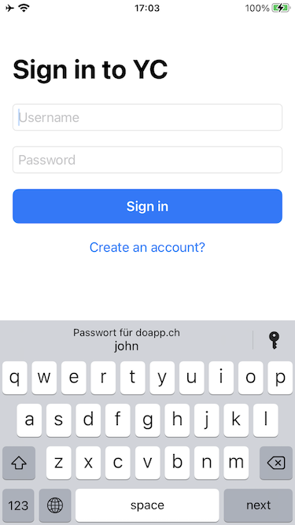
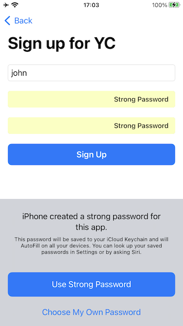
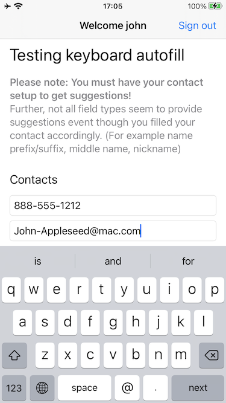

# Autofill playground

This simple app is about exploring the necessary parts to allow an app work with autofill, i.e. the iOS keyboard
automatically suggest the required information to fill in.

## Password autofill

Feature description:

- suggesting existing passwords stored in the keychain to sign-in
- suggesting a strong password to use when signing up.  

To implement this feature I had to do the following steps:

1. Add "Associated Domains" capability and set "Domains" to `webcredentials:example.com` (replacing `example.com` being my domain).

2. On the website place a file named `apple-app-site-association` into the publicly accessible root directory in a folder `.well-known`.  
Access can be tested using `curl https://www.example.com/.well-known/apple-app-site-association`. (Yes, HTTPS must be enabled and have a valid certificate!)

3. The content of the `apple-app-site-association` must reference the Apple Developer Team ID and the bundle identifier
   of my app as follows: (Team ID is "A1BC23REUG" and bundle identifier is "com.example.signin-playground")

    ```json
    {
      "webcredentials": {
        "apps": [ 
          "A1BC23REUG.com.example.signin-playground"
        ]
      }
    }
    ```

4. Mark the input fields in SwiftUI using the appropriate `textContentType` modifiers: `.username`, `.password` and
   `.newPassword`.

 

## TextField autofill

Feature description:

- intelligent completion based on information from the address book or recent usage of other apps

To implement this feature I had to amend the `TextFields` fields with the [appropriate value](https://developer.apple.com/documentation/uikit/uitextcontenttype)
for the `textContentType` modifier.
But some of the fields have never shown an appropriate suggestion.  
These are: `.namePrefix`, `.nameSuffix`, `.middleName`, `.nickname`, `.organizationName`, `.jobTitle`, `.location`


